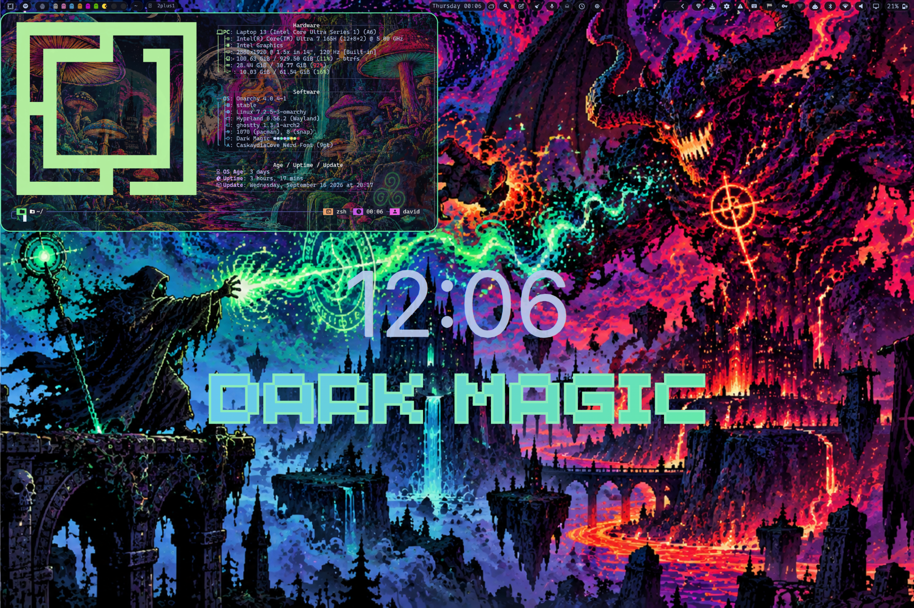

# Dark Magic Theme

A dark Omarchy theme with mint accent (#66eeaa) and blue secondary (#6bc7f5).

## Preview




## Installation

### Omarchy Theme

Install directly from this repo:

```bash
omarchy theme install https://github.com/davidsmorais/omarchy-dark-magic-theme
```

Or use the Omarchy menu: `Super + Space` → `Install > Style > Theme`, then paste the repo URL.

Once installed, activate it with:

```bash
omarchy theme set "Dark Magic"
```

### Terminal Wallpapers + Ghostty Setup (Optional)

Install terminal wallpapers and set up Ghostty to cycle through them:

```bash
./install.sh
```

This will:
- Copy 5 shroom terminal backgrounds to `~/.config/ghostty/backgrounds/dark-magic/`
- Install the `set-background` script to `~/.config/ghostty/bin/`
- Configure Ghostty to use the wallpapers
- Set the initial wallpaper

After installation, cycle wallpapers with:
```bash
set-background next           # cycle to next wallpaper
set-background shrooms1       # set specific wallpaper (1-5)
```

## What's Included

- `colors.toml` - Full 16-color palette with mint accent (#66eeaa) and blue secondary (#6bc7f5)
- `alacritty.toml` - Alacritty terminal color scheme
- `btop.theme` - btop++ system monitor theme
- `cava_theme` - Cava audio visualizer gradient theme
- `chromium.theme` - Chromium browser theme colors
- `dimming.sh` - Toggle script for inactive window dimming in Hyprland
- `ghostty.conf` - Ghostty terminal color palette
- `gtk.css`, `gtk-3.0/`, `gtk-4.0/` - GTK 3 and GTK 4 / Libadwaita styling
- `hyprland.conf` - Window manager config with mint accent borders, dimming, and smooth animations
- `hyprland-preview-share-picker.css` - Screen share picker styling
- `hyprlock.conf` - Hyprlock lockscreen theme
- `icons.theme` - Icon theme configuration
- `kitty.conf` - Kitty terminal theme
- `mako.ini` - Mako notification daemon styling with Wi-Fi & update actions
- `neovim.lua` - Complete Neovim / LazyVim theme with treesitter, LSP, and UI highlights
- `obsidian.css` - Obsidian markdown editor theme
- `qt6ct.conf` - Qt6 configuration tool color scheme
- `steam.css` - Adwaita-for-Steam theme
- `superfile.toml` - Superfile terminal file manager theme
- `swayosd.css` - SwayOSD on-screen display theme
- `system24.css` & `vencord.theme.css` - Discord / Vencord / Vesktop system24 styling
- `vscode.json` - VSCode theme integration (`DavidMorais.dark-magic-themes`)
- `walker.css` - Walker application launcher theme
- `waybar.css` - Waybar status bar palette styling
- `zed.json` & `zed/themes/` - Zed editor theme configuration
- `zen.css` - Zen Browser color styling
- `backgrounds/` - Theme backgrounds including signature `dark-magic.png`
- `terminal-backgrounds/` - 5 high-res shroom wallpapers for Ghostty
- `bin/set-background` - Script to cycle terminal wallpapers
- `install.sh` - Automated setup for terminal backgrounds

## Credits

Created by David Morais (davidsmorais)

